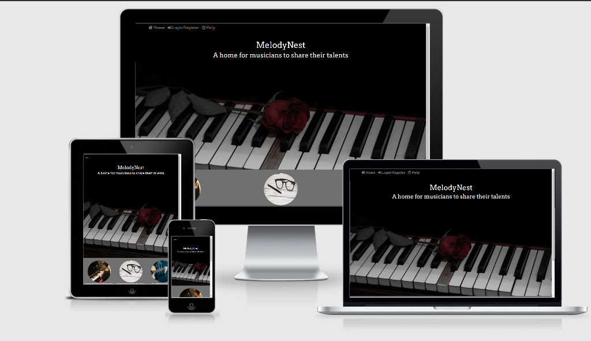
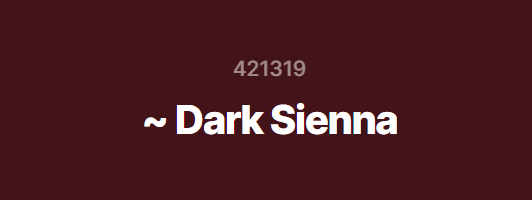
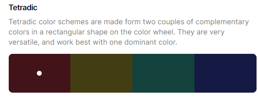
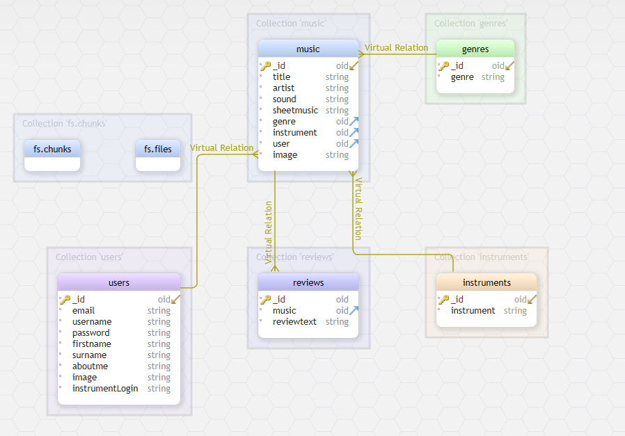

# Melody Nest

MelodyNest is a website that allows musicians to share music with other musicians. They are able to upload audio recordings of their music, information about the piece, and a copy of the sheet music. 
They can also write reviews on other musicians pieces and keep an up to date profile page.  

[*Am I Responsive?*](http://ami.responsivedesign.is/#) was used to test how responsive the website is on different devices.
## Table of Contents

---

1. [UX](#ux)
   - [Strategy Plane](#strategy-plane)
        - [User Stories](#user-stories)
   - [Scope Plane](#scope-plane)
        - [Viability](#project-viability) 
        - [Typography](#typography)
   - [Structure Plane](#structure-plane)   
   - [ Skeleton Plane](#skeleton-plane)
        - [Wireframes](#wireframes)
   - [Surface Plane](#surface-plane)
        - [Colors](#colors)
        - [icons](#icons)
   - [InformationArchitecture](#information-architecture)
2. [Features](#features)
   - [Existing Features](#existing-features)
   - [Features left to implement](#features-left-to-implement)
3. [Technologies Used](#technologies-used)
   - [Front End Technologies](#front-end-technology)
   - [Frameworks](#frameworks-used)
4. [Testing](#testing)
   - [Validators](#validators)
   - [Testing Methods](#testing-methods)
5. [Deployment](#deploy)
   - [Local Deployment](#local-deployment)
   - [Remote Deployment](#remote-deployment)
6. [Credits](#credits)
   - [Content](#content)
   - [Media](#media)
   - [Acknowledgements](#acknowledgements)

---

## UX

### Design Process

--- 

### Strategy Plane

#### *Developer Stories*

 - As the developer, I want to create a website so musicians can share their music with other musicians. 

 - As the developer, I want the website to be aesthetically pleasing to those who visit the website making good use of HTML, CSS and Bootstrap. 

 - As the developer, I want to website to function in the intended ways using Javascript/JQuery and Python.

 - As the developer, I want everything shared to be stored in a back end data network, in this case I will be using MongoDB 

#### *Site Owner Stories*

- As the site owner, I want users to have a positive experience so that the number of users grows continually. 

- As the site owner, I want to have a pleasant experience when I add, edit and delete items that I moderate as innapropriate or no longer necessary. 

#### *User Stories*

This is created so users can share music they have arranged or composed, sharing the audio and the sheet music.

- As a user, I want to be able to share the sheet music I arrange or I compose

- As a user, I want to be able to share an audio file of the music I performed on my chosen instrument

- As a user, I want to have a profile page where I can share information about myself in terms of music. 

- As a user, I want to write reviews about the music shared by other users

- As a user, I want to see what others think of the music I have shared

- As a user, I want to see an attractive website that makes me want to use it. 

- As a user, I want to see other users profile pages, and see what they have shared

- As a user, I want to listen to other users performances

- As a user, I want to be able to download some new music that others have shared.

### Scope Plane

After deciding on the main aims of the project, I considered the features that were realistic in the time frame of the project. I used the user stories to come up with a list of features, their importance and their viability. Anything less viable will be considered as more likely being added as a future feature (will be viewable in the features section).

#### *Project Viability*

|     | Feature                          | Importance | Viability |
| --- | ---------------------------------| :--------: | --------: |
| A   | Music player                     |     5      |         5 |
| B   | Sheet music PDF sharing          |     5      |         5 |
| C   | Image upload                     |     5      |         5 |
| D   | Reviewing                        |     3      |         4 |
| E   | Profile page and updatable info  |     4      |         4 |
| F   | Rating system                    |     3      |         3 |
|     | ---------------------------------|            |           |
|     | Total                            |     25     |        26 |

### Structure Plane

The following is how the website will be structured, based on the scope of the project:

-On the Navbar the left side Navbar is for user information, such as user profile and login. The second Navbar is for navigating around the website. 

- The Navbar will have a login/register on the left hand side if user isnt logged in to the site. 
    - login/register sends user to a login page, with option to register underneath the login form. 
    - If a new user registers, after completion it will return to the login and ask the user to login for the first time

- If the user is logged in the Navbar will say the username, which links to their profile page. It will also have a logout link next to it 
    - In the profile page, users can view their details and change their details.
- the right side of the navbar will have Home, music, profiles, share, reviews and help 
    - home brings the user back to the home page
    - music allows the user to view all the uploaded pieces of music, with the option to listen to them performed, and view the sheet music. Also the option to edit or delete ones they have uploaded, or review other users uploads.
    - profiles allows the user to see all the other users and link to their profiles
    - share will allow the user to upload their piece of music, including: title, artist, image, audio, genre, instrument, and sheet music pdf
    - reviews will allow users to view all reviews for all pieces of music
    - help has some frequently asked questions for supporting users

### Skeleton Plane

#### *Wireframes*

Click here to see the project [Wireframes](wireframes.md) (added to seperate file due to size)

The project mostly follows the wireframe, however, there is a variation from the wireframe. There is now only one navbar as it looked much better as a design point than the two navbars. 

### Surface Plane

#### *Typography*

The font Arvo was used as it is a serif font. Serif fonts are known for their roman types. 
[As music is associated with latin](https://www.fonts.com/content/learning/fontology/level-1/type-anatomy/type-classifications) (as shown with terminology for dynamics), a serif font was appropriate for this project.

1 [Google Font](https://fonts.google.com/) was used throughout this website:
- ["Arvo", serif;](https://fonts.google.com/specimen/Arvo)

#### *Colors*

#### *Foundation colours*
These were used as the main colours. A more monochromic approach 

- "white": "white"
- "black": "black"
- "gray": #707070,
- "gray-dark": #3f3f3f,

#### *Accent colours* 
The red was chosen from a colour picker on the rose itself on the home page image.
The other colours were chosen to compliment the selected red colour. According to this [website](https://www.canva.com/colors/color-wheel/), they are either tetradic or analogous.

 Main accent colour

images created from [here](https://coolors.co/)

Tetradic - Chosen for boldness but to compliment the red as the primary colour. Red is used for anything larger, with the smaller buttons having the tetradic colours.

 

   #421319   433D14   14433D   141A43

#### *Icons*

[Font Awesome 5.13.1](https://fontawesome.com/)

Used for the play and stop button on the music player
  
#### *Image modifications*

- [GIMP](https://www.gimp.org/) was used to tweak the main page image so the top was plain black so title could be added without conflicting with the words on the piano. 
Permissions for editing image ok.  

### Information Architecture

I used MongoDB to store the data that the website uses. I used the [documentation](https://docs.mongodb.com/manual/) in order to support me with the python coding. 

I have cluster set up called mnCluster and inside that cluster I have a group of collections

These two are created when I the python was set up in order to send music/images/pdfs to mongoDB and they are stored within fs.files. This used the mongo.save_File code.
- fs.chunks
- fs.files

The rest I created for the databases themselves
- genres
- instruments
- music
- reviews
- users

This is a schema ([created with this software](https://dbschema.com/download.html)) to explain how the data responds to each other. 

oid = objectId 

##### Back to [top](#table-of-contents)
---

### Features

---

#### Existing Features

- View shared music

  - Able to see cards of different pieces of music. 
  - Shares Name of piece, artists name, genre of the music, instrument performed with, username, button to the sheet music pdf on a new tab, play and stop button with performance playing

- Write a review 

  - Able to write a review on the piece of music shared. The button pops up on any pieces of music not created by the current user. This opens up a page for user to type what they think of the music. 

- Share pieces of music

   - Page called share which allows a user to type in a title and  artist of the piece of music. 
   - Choose a genre and instrument from the dropdown. If genre or instrument isnt there, a new one can be added
   - Upload an audio file which will be playable on the piece of music card
   - Upload an image/piece of artwork which will show up as the main image for that piece of musics card
   - Upload sheet music which can be accessed by users clicking on the sheet music on the card. This links the uploaded music to a new page.  

- Edit and delete pieces

  - If the piece of music belongs to the user, they can either delete it by clicking on the delete button.
  - The users can edit the pieces by clicking on the edit button and going to a page which fills in previously filled info into the shared form page

- Sound  

  - Music plays through the play bottom at the bottom of the cards. If play is clicked, it stops all music on the page and just starts that one. Stop Stops all music on the page. 
  
- Profile Pages 

  - Page full of profiles where every profile can be accessible. Shows the user names and profile images of every user
  - Profile page shows the users chosen profile image. Information about themselves from inputted data on register, and an about me page that can be edited any time. 
  - Edit profile button which opens up a similar looking page if the profile belongs to the current user
  - All pieces of music shared by that user is viewable at the bottom of this page

- Edit profile Page

  -  Change profile picture 
  -  Change about me information
  -  Change registration information (email, password, name, preferred instrument)
  -  Update changes button updates all information changed in the form
  -  Go back returns to the users profile page

-  

#### Features to Implement

- 5 star system where users can give a rating to the piece they review. 
- Sort feature to select reviews by piece order
- Questions users ask will be updated by admin with a future update where the admin can add new questions and answers to the help page. 

- On the help page there is an email address for admin@melodynest.com. This is not a real email address as this is just a demo website 
for a Code Institute project. A future feature would be to add the chance for users to email a real address. The most likely update will 
be a contact page where users can send an email directly on the website that new users will be able to access as well as logged in users.  

##### Back to [top](#table-of-contents)

---

## Technologies Used

---

- HTML

  - This project uses HTML to create the main functions of the website.
  - [HTML](https://en.wikipedia.org/wiki/HTML)

- CSS

  - This project uses CSS to add styling to features. It is also used to tweak some of the bootstrap. (Sass is also used to achieve this.)
  - [CSS](https://en.wikipedia.org/wiki/CSS)

- Python

  - This project uses Python for the main database related features. It ensures that all information shared between MongoDB and the project are accessible and respond to one another.
  - [Python](https://en.wikipedia.org/wiki/Python_(programming_language))

- Javascript

  - This project uses Javascript to create functions, rules and effects in order to make the certain features work. Features include being able to use a music player. Updating and showing dropdown menus for genre/instruments. Shrink the number of words on a review card until read more is clicked if over a certain amount.
  - [Javascript](https://en.wikipedia.org/wiki/JavaScript)

#### Frameworks Used

- Bootstrap
    - Bootstrap is an open source library with access to reusable bits of code for html, css and javascript.
    - [Bootstrap](https://getbootstrap.com/) 

- jQuery
    - jQuery is an open source library that makes using javascript easier and quicker. It simplifies a variety of multiple lines of javascript code by putting it into a single line of jquery code. 
    - [jQuery](https://jquery.com/)

- Flask
    - Flask is a micro web framework written in Python
    - Uses Workzeug which is a utility library for the Python programming language
    - Uses Jinja which is a template engine for the Python programming language
    - [Flask](https://flask.palletsprojects.com/en/1.1.x/)

- NodeJs
    - npm was installed so bootstrap was modifiable. 
    - [NodeJs](https://en.wikipedia.org/wiki/Node.js)

- Sass
    - Sass is used to tweak the stylesheets so bootstrap is editable. It allows the custom code to be added to the bootstrap. Installed [Ruby](https://en.wikipedia.org/wiki/Ruby_(programming_language)) in order to use Sass with gem install sass
    - [Sass](https://en.wikipedia.org/wiki/Sass_(stylesheet_language))
 
##### Back to [top](#table-of-contents)

---

## Testing

---

### Validators

- HTML

  - [W3C HTML Validator](https://validator.w3.org/) More information below for each html file
    - base.html - Only Errors are relating to Jinja
    - edit_profile.html - Only Errors are relating to Jinja, warning for the button, being unnecessary, but without it, it doesn't work.
    - edit_review.html - Only Errors are relating to Jinja, warning for the button, being unnecessary, but without it, it doesn't work.
    - help.html - Only Errors are relating to Jinja
    - index.html - Only Errors are relating to Jinja
    - list_profiles.html - Only Errors are relating to Jinja
    - login.html - Only Errors are relating to Jinja
    - music.html - Only Errors are relating to Jinja
    - register.html - Only Errors are relating to Jinja
    - user_profile.html - Only Errors are relating to Jinja
    - write_review.html - Only Errors are relating to Jinja, warning for the button, being unnecessary, but without it, it doesn't work.
    - share.html - Only Errors are relating to Jinja Select and input and select error appears seemingly due to for and if statements.
    - edit_share.html - Only Errors are relating to Jinja and input and select error appears seemingly due to for and if statements.
    - change_password.html - Only Errors are relating to Jinja warning for the button, being unnecessary, but without it, it doesn't work.
    - admin_change_password.html - Only Errors are relating to Jinja warning for the button, being unnecessary, but without it, it doesn't work.
    - admin_profile_edit.html - Only Errors are relating to Jinja, warning for the button, being unnecessary, but without it, it doesn't work.

- CSS

  - [W3C CSS Validator](https://jigsaw.w3.org/css-validator/) "Congratulations! No Error Found. This document validates as CSS level 3 + SVG !"

- Javascript

  - [JSHint javascript Validator](https://jshint.com/) There are no critical errors, but there are warnings for $ used in jquery.

- Python
  - [PEP8 online](http://pep8online.com/) "All right"

### Testing Methods

For information on the testing, follow the link to the document [here](testing.md)

##### Back to [top](#table-of-contents)
---

## Deployment

---

### Remote Deployment

- Go to your Github repository and open it using GitPod index
- In the terminal run the command "pip3 freeze --local > requirements.txt" to create a .txt file with all of the dependencies for Heroku
- In the terminal run the command "echo web: python run.py > Procfile" to create a Procfile for Heroku
- Check the Procfile - remove any previous blank lines above web: python app.py
- Log in to Heroku and select "Create New App"
- Select the input field "App Name"
- Give your app a name you haven't already used
- Select the region closest to your location (ireland for me) as I am in England
- Click "Create App"
- To connect the app to your Github repository, click on the Github icon inside of the "Deployment Method" section
- Here there will be a new section called "Connect to Github" - ensure your Github profile is displayed inside it
- Insert your repo name inside the "Connect to Github" section next to where your profile is displayed
- Click on the "Search" button, once it finds your repo click the "Connect" button
- Click on the settings tab at the top of the page, and select "Reveal Config Var"
- Add the variables for IP, PORT, SECRET_KEY, MONGO_URI and MONGODB_NAME 
- Return to the Gitpod IDE and make sure you have pushed the requirements.txt and Procfile
- Return to Heroku and select "Enable Automatic Deployment"
- Select your master branch under "Branch Selected"
- Click on the "Deploy Branch" - wait for the app to build
- Once the site is deployed, click "View" to launch the app
- As "Enable Automatic Deployment" has been selected, any pushes to github will be updated automatically by heroku. 

### Local Deployment

- Go to the Github repository and click on the "Code" dropdown and select "download zip". This downloads a zip file with all of the files required to run the website
- Next, open VSCode and add all the files from the zip to this project by unzipping the file into documents and dragging them into VSCode
- Add a env.py file and add all the information for the IP, PORT, SECRET_KEY, MONGO_URI and MONGODB_NAME relating to the mongoDB file 
- Open the command pallette and select Python: select interpereter
- Open the terminal and type in Python3 -m pip install flask
- Open the terminal and type in Python3 -m pip install flask-pymongo
- Open the terminal and type in Python3 -m pip install pymongo
- Open the terminal and type in Python3 -m pip install dnspython
- Open the terminal and type in Python3 app.py
- Follow the IP address link Running on http://0.0.0.0:5000/
- in the url, change http://0.0.0.0:5000/ to htto://127.0.0.1:5000 to open it locally

##### Back to [top](#table-of-contents)
---

## Credits

---

### Content

- All written content was my own.
- [Unsplash](https://unsplash.com/photos/sS0-eF5uy_U) - Main home image
- [pixabay](https://pixabay.com/photos/piano-boy-playing-learning-78492/) - first circle image on home page
- [pixabay](https://pixabay.com/photos/eyeglasses-music-sheet-music-pen-1209707/) - second circle image on home page
- [pixabay](https://pixabay.com/photos/guitar-guitarist-music-756326/) - third circle image on home page

### Media

- Uploaded piano pieces were performed by myself
- Alton towers theme(hall of the mountain King) was downloaded from [here](https://www.youtube.com/watch?v=2fGkrHuNS7k)
- All images used for uploading are found on [google images](www.google.com) by using images/tools/usage rights/commercial and other licenses.
- For the purpose of this project I have used sheet music that is already written and by others as the time constraints for this project dont allow time for writing my own music. 

### Acknowledgements

- I'd like to thank the slack community for their support, particularly the May 2020 cohort group who have given me support and suggestions.
- I'd like to thank my mentor Adeye Gbenga for his support through the project.  
- I'd also like to thank my friends and family for their support, and their support with testing of the website. 
- I'd particularly like to thank my parents for ensuring I had piano lessons when I was younger, as this is what gave me the inspiration for this website.  

##### Back to [top](#table-of-contents)
