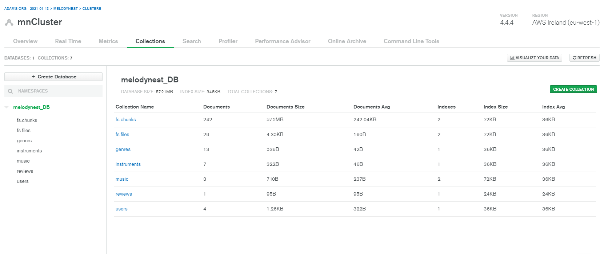
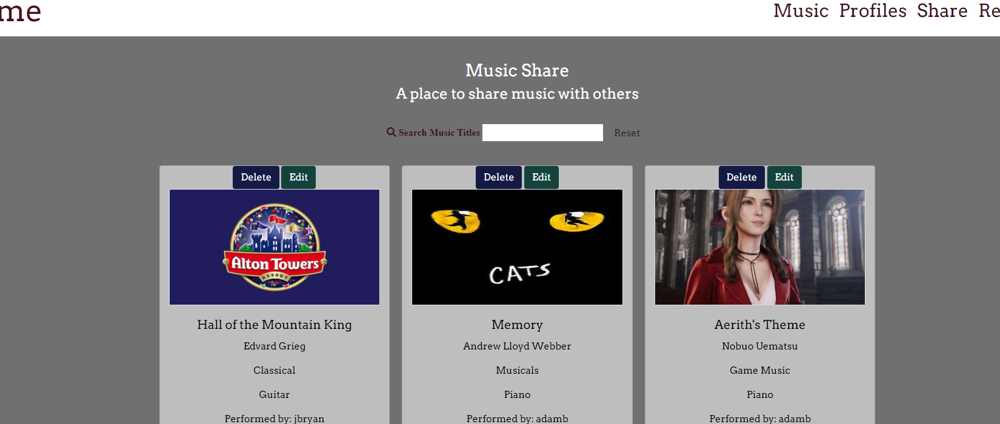
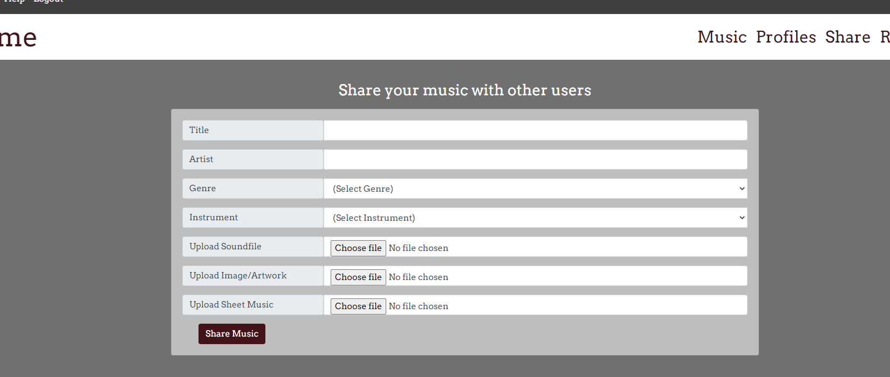
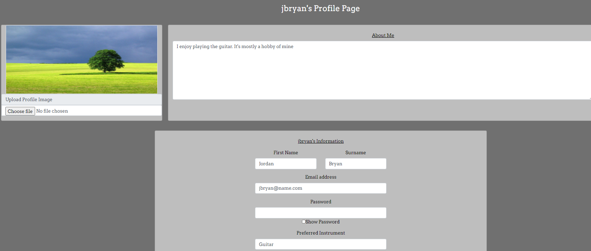
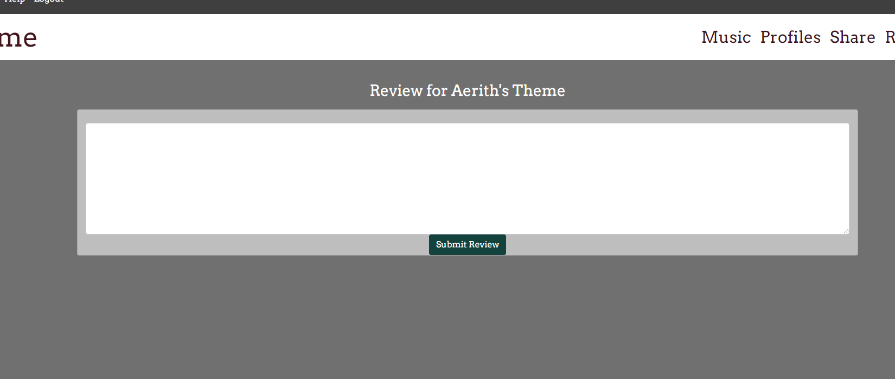
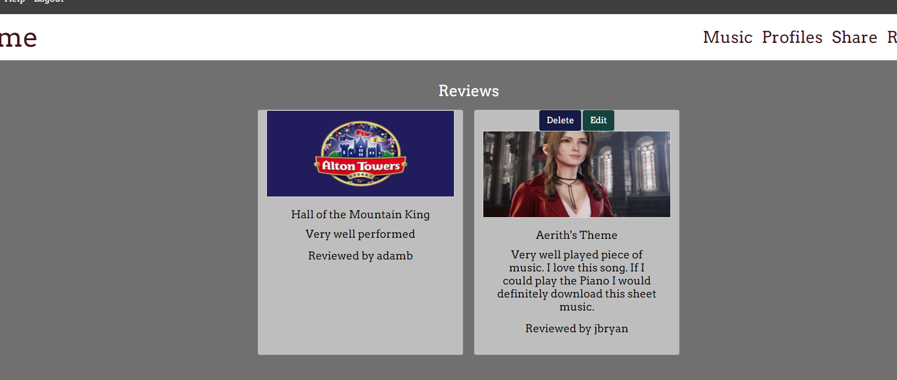
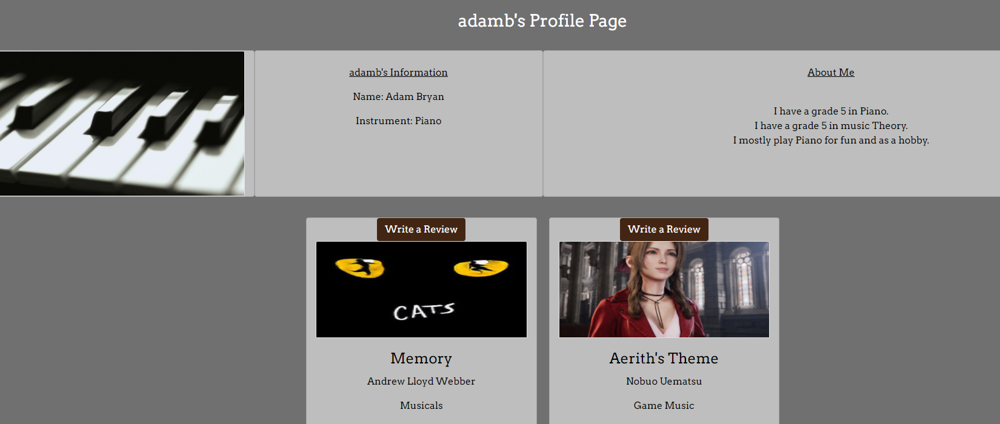
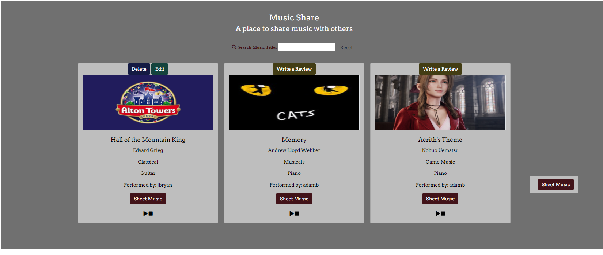

# Memory Nest Testing

---

## *Developer Stories*

 ### As the developer, I want to create a website so musicians can share their music with other musicians. 

 ### As the developer, I want the website to be aesthetically pleasing to those who visit the website making good use of HTML, CSS and Bootstrap. 

- See user stories

 ### As the developer, I want to website to function in the intended ways using Javascript/JQuery and Python.

-  Javascript/JQuery and Python were used for functions and are all working as intended. 

 ### As the developer, I want everything shared to be stored in a back end data network, in this case I will be using MongoDB 
- Developer used mongoDB to create collections, and built code around adding documents to those collections. 

 

 ## *Site Owner Stories*

### As the site owner, I want users to have a positive experience so that the number of users grows continually. 
- See user stories to see how this has been achieved

### As the site owner, I want to have a pleasant experience when I add, edit and delete items that I moderate as innapropriate or no longer necessary. 
- Admin has access to editting and deleting profiles, uploaded pieces of music, and reviews. 

## *User stories*

### As a user, I want to be able to share the sheet music I arrange or I compose
- A user can share an their sheet music. 

### As a user, I want to be able to share an audio file of the music I performed on my chosen instrument
- A user can share an audio file. 

### As a user, I want to have a profile page where I can share information about myself in terms of music. 
- Users have a profile page that they can edit at any point.

### As a user, I want to write reviews about the music shared by other users
- User can click on a piece of music that isn't their own and write up a review about it

### As a user, I want to see what others think of the music I have shared
- Other users can share reviews and all of these are viewable by visiting the review tab. A future feature will include a sort option so you can sort by piece title, user or recent. 

### As a user, I want to see an attractive website that makes me want to use it. 
- The user will find the website easy to understand, all links work, it's colour scheme is muted and understated to fit the theme, with an appropriate font style. 

### As a user, I want to see other users profile pages, and see what they have shared
- users can access the profiles of other users and also see what music they have uploaded

### As a user, I want to listen to other users performances
- users can listen to the music of other users by pressing the play button on the piece card. 

### As a user, I want to be able to download some new music that others have shared.
- users can view and save the pdf of the shared sheet music by clicking on the sheet music button a card. This brings up a new tab with the pdf file shared. 

## Major Bugs

### Fixed Bugs

- New users cannot access profiles 

    - This bug was solved by adding a simple if else statement on the user_profile.html. If the length of the useruploads array has 1 or more items inside it, then it loads up the users uploaded music. , else it says user hasnt uploaded any music. 

- When a user updates a new piece, it changes all the other details on genre and instrument to say the same for every piece.(in profile view only).

    - This bug was due to an error in the code written, and was a simple and obvious fix. At the bottom of the user profile, the append to array code (useruploadstitle.append(piece)) needed to go below all the information in the for loop, where as I had it written before. 

- Having fixed the bug in which a new user could access their profile, after adding search to music, and tweaking the navbar, it seemed to cause a bug where a user without any uploads cannot access their profile or edit it. However, the profile can be accessed from the profile list tab.

    - To fix this new error, I had added some unnecessary files to the app.py for user_profile function. Piece=piece was causing it to made it a priority to check if a piece of music had been included by the user. Having removed this, a new user had access to their profile and edit of the profile, without having to have already uploaded.

- When admin deletes a user, music and reviews are no longer accessible, as the original users ObjectId no longer exists.

    - To fix this bug, I had to set the write_review function to send the userid of the original performer to the reviews document in mongodb. Then On the delete_user function, I used a db.music.remove and a db.review.remove with the routes leading to the ObjectId of those files in music and review. It now removes every file relating to that user. 

### Ongoing Bugs

- MongoDB filling up with unused data

    - Ongoing bug that will need fixing in the future. Cannot find out how to code in a fix to delete files as a user deletes from the system with the GridFS system. Will continue to look into. But currently a housekeeping task for developer in the meantime.

## User opinions

##### Back to [readme](README.md)